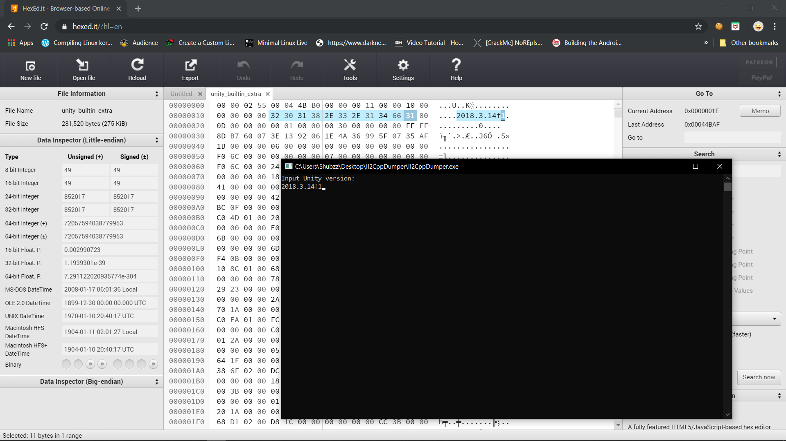
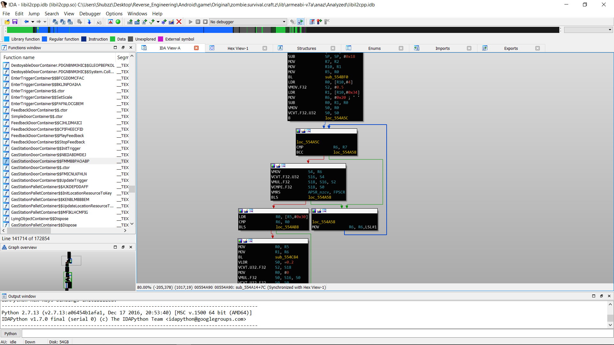

# Il2CppDumper!

Extract .NET metadata from il2cpp binaries. (types, methods, fields, etc.)

# Output files

- `DummyDll` :- DLLs generated by Mono.Cecil which contain the .NET metadata extracted from the binary (no code included). Can be viewed in .NET decompilers (ILSPy, DnsPy, JetBrains dotPeek (recommended) ). 
- `script.py` :- Requires IDA (I use IDA 7.0 Pro ) and IDAPython. 
- `dump.cs` :- C# pseudocode. Can be viewed in text editors (syntax highlighting recommended)

## Usage

- ### To extract Dll's
	1. `git clone https://github.com/Shubzz-02/Il2CppDumper.git`
	2. Copy your `libil2cpp.so` and `global-metadata.dat` to Il2CppDumper/ folder.
	3. Run `Il2CppDumper.exe` choose  `libil2cpp.so` and `global-metadata.dat`.
	4. To find unity version open `/assets/bin/Data/Resources/unity_builtin_extra` in any hex editor ( try [hexed](https://hexed.it/?hl=en))  and look at address `0x00000014`  (see screenshots attached below) you will find something like `2018.3.14f` this is the unity version you need, type this in terminal and press enter.
	5. In mode selection Select 3 (recommended) wait until process finish.
	6. Now in DummyDll folder you will find some .dll files these contain .NET metadata extracted from the binary, Open `Assembly-CSharp.dll` in any .NET decompilers  (ILSPy, DnsPy, JetBrains dotPeek (recommended) ).
- ### To extract method name In IDA
	1. Follow above Step 1 and 2.
	2. Open `libil2cpp.so` in Ida (Note :- Use IDA Pro ) and wait until Ida load it completely.
	3. Load `script.py`   in Ida via `File -> Script file`, and wait for script to execute.
	4. Now you will see functions name in Ida Function Window.
	5. Done! happy Reversing

# ScreenShots
  